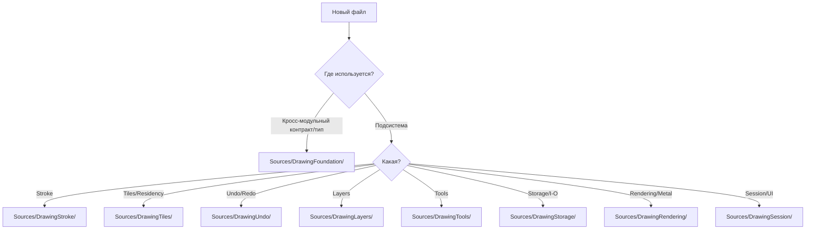

# File System Specification: Project Structure & Organization Policy

**Status**: ✅ REFINED (Audit V6 - Modular by Subsystems)
**Role**: Единый стандарт размещения исходного кода, ресурсов и именования компонентов DrawEngine.

---

## 🏛 Общие принципы организации

1.  **Modular Isolation**: Исходники разделены по подсистемам (DrawingTiles, DrawingUndo, DrawingStroke, DrawingTools, DrawingLayers, DrawingStorage, DrawingRendering, DrawingSession).
2.  **Foundation First**: Все кросс-модульные контракты, протоколы и `Sendable`-снапшоты находятся в `DrawingFoundation`.
3.  **Actor Locality**: Реализация актора живет в модуле своей ответственности (например, `TileSystem` -> `DrawingTiles/Actor/`).
4.  **Rendering / Storage Boundaries**: Metal-ресурсы только в `DrawingRendering` или `DrawingTiles`, disk I/O только в `DrawingStorage`.
5.  **Predictability**: Местоположение нового файла должно быть очевидным исходя из ответственности.

### Схема выбора пути (Decision Tree)



---

## 📂 Дерево папок и правила распределения

```text
Sources/
├── 📦 DrawingFoundation/
│   ├── 📂 Core/Math/
│   ├── 📂 Core/Handshake/
│   ├── 📂 Core/Protocols/
│   └── 📂 Models/                 # Shared Sendable snapshots/contracts
│
├── 📦 DrawingRendering/
│   ├── 📂 Shaders/                 # .metal & SharedTypes.h
│   ├── 📂 Pipelines/               # PSO descriptors
│   └── 📂 View/                    # MetalDrawView
│
├── 📦 DrawingTools/
│   ├── 📂 ToolManager/
│   ├── 📂 Tools/                   # BrushTool, EraserTool, FillTool
│   ├── 📂 Pipelines/               # GlobalOperationProcessor
│   └── 📂 Materials/               # Sidecar contracts
│
├── 📦 DrawingStroke/
│   ├── 📂 Actor/                   # StrokeProcessor
│   ├── 📂 Models/                  # StrokePoint, GeometrySnapshot
│   └── 📂 Processors/              # Spline, Binning, Prediction
│
├── 📦 DrawingTiles/
│   ├── 📂 Actor/                   # TileSystem
│   ├── 📂 Models/                  # TileCoord, ResidencySnapshot
│   ├── 📂 Residency/
│   └── 📂 CoW/
│
├── 📦 DrawingUndo/
│   ├── 📂 Actor/                   # UndoManager
│   ├── 📂 Models/                  # TransactionToken, UndoRecord
│   └── 📂 Pipeline/                # Serial Commit Pipeline
│
├── 📦 DrawingLayers/
│   ├── 📂 Actor/                   # LayerManager
│   ├── 📂 Models/                  # LayerState, LayerStackSnapshot
│   └── 📂 Snapshot/
│
├── 📦 DrawingStorage/
│   ├── 📂 Actor/                   # DataActor
│   ├── 📂 WAL/                     # Write-Ahead Log
│   ├── 📂 ProjectPackage/          # .drawproj structure
│   └── 📂 Compression/             # LZ4
│
└── 📦 DrawingSession/
    ├── DrawingSession.swift        # Root Orchestrator
    ├── CanvasEnvironment.swift
    └── 📂 FrameLifecycle/
```

---

## 🏷 Соглашения об именовании

| Тип компонента | Суффикс / Префикс | Пример | Папка |
| :--- | :--- | :--- | :--- |
| **Actor** | `...Actor` или функциональное имя | `DataActor`, `TileSystem` | `Drawing*/Actor/` |
| **Snapshot (Sendable)** | `...Snapshot` или `...State` | `LayerState`, `GeometrySnapshot` | `DrawingFoundation/Models/` или `Drawing*/Models/` |
| **Metal Pipeline** | `...Descriptor` | `BrushRenderDescriptor` | `DrawingRendering/Pipelines/` |
| **UI Proxy (MainActor)** | `...Entity` | `LayerEntity` | `DrawingFoundation/Models/` или `DrawingLayers/Models/` |
| **Protocol** | `...Protocol` или `...ing` | `Drawable`, `TileManaging` | `DrawingFoundation/Core/Protocols/` |

---

## 🛠 Правила добавления новых файлов

1.  **Сначала модуль**: Определите подсистему. Если тип используется несколькими модулями — это `DrawingFoundation`.
2.  **Если это Actor**: Размещайте в `Drawing*/Actor/` модуля ответственности. Не нарушайте 6-Actor Model.
3.  **Если это Модель**: Локальные модели — в `Drawing*/Models/`. Общие контракты и снапшоты — в `DrawingFoundation/Models/`. Все модели должны быть `Sendable`.
4.  **Если это Metal-ресурс**: Только `DrawingRendering/` или (ресидентные ресурсы) внутри `DrawingTiles/`.
5.  **Если это Disk I/O**: Только `DrawingStorage/` (WAL, ProjectPackage, Compression).
