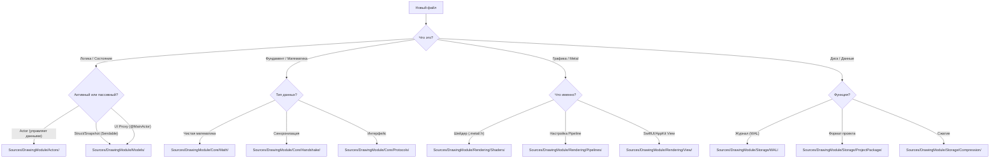

# File System Specification: Project Structure & Organization Policy

**Status**: ✅ REFINED (Audit V5 - Focus on File Distribution)
**Role**: Единый стандарт размещения исходного кода, ресурсов и именования компонентов DrawEngine.

---

## 🏛 Общие принципы организации

1.  **Strict Isolation**: Файлы распределяются по зонам ответственности (Core, Actors, Models, Rendering, Storage). Перекрестные зависимости между зонами минимизируются.
2.  **Swift 6 Safety**: Все типы в `Models/` и `Core/Handshake/` обязаны быть `Sendable`.
3.  **Actor Separation**: Папка `Actors/` содержит только реализации `actor` или объектов, инкапсулирующих состояние актора. Прокси-объекты для UI и модели данных выносятся в `Models/`.
4.  **Predictability**: Местоположение нового файла должно быть очевидным исходя из его типа.

### Схема выбора пути (Decision Tree)



---

## 📂 Дерево папок и правила распределения

```text
Sources/DrawingModule/
├── 📂 Core/                   # "Незыблемое" (No dependencies)
│   ├── 📂 Math/               # Geometry, Splines, GOM
│   ├── 📂 Handshake/          # Sendable snapshots for Frame Sync
│   └── 📂 Protocols/          # API Contracts
│
├── 📂 Models/                 # "Данные" (Passive)
│   ├── 📂 Layer/              # LayerState (Snapshot), LayerEntity (UI Proxy)
│   ├── 📂 Stroke/             # StrokePoint, StrokeGeometry
│   └── 📂 Tile/               # TileCoord, TileMetadata
│
├── 📂 Actors/                 # "Мозги" (6-Actor Model)
│   ├── 📂 DrawingSession/     # Orchestrator
│   ├── 📂 TileSystem/         # Resource/Memory Manager
│   └── ...                    # Other 4 Actors
│
├── 📂 Rendering/              # "GPU" (Metal specific)
│   ├── 📂 Shaders/            # .metal & SharedTypes.h
│   ├── 📂 Pipelines/          # State descriptors
│   └── 📂 View/               # MetalDrawView (DisplayLink)
│
└── 📂 Storage/                # "Persistence" (Disk I/O)
    ├── 📂 WAL/                # Transaction Logs
    └── 📂 ProjectPackage/     # .drawproj structure
```

---

## 🏷 Соглашения об именовании

| Тип компонента | Суффикс / Префикс | Пример | Папка |
| :--- | :--- | :--- | :--- |
| **Actor** | `...Actor` или функциональное имя | `DataActor`, `TileSystem` | `Actors/` |
| **Snapshot (Sendable)** | `...Snapshot` или `...State` | `LayerState`, `GeometrySnapshot` | `Models/` |
| **Metal Pipeline** | `...Descriptor` | `BrushRenderDescriptor` | `Rendering/Pipelines/` |
| **UI Proxy (MainActor)** | `...Entity` | `LayerEntity` | `Models/` |
| **Protocol** | `...Protocol` или `...ing` | `Drawable`, `TileManaging` | `Core/Protocols/` |

---

## 🛠 Правила добавления новых файлов

1.  **Перед созданием**: Используйте Decision Tree для определения корневой папки.
2.  **Если это Актор**: Проверьте, не нарушает ли он 6-Actor Model. Если функции нового актора можно делегировать существующему — делайте это.
3.  **Если это Модель**: Она должна быть в папке `Models/` и быть `Sendable`. Если она нужна для UI — добавьте её в `Models/` с суффиксом `Entity`.
4.  **Если это Metal-ресурс**: Все обертки над `MTLResource` должны находиться в `Rendering/` или управляться исключительно внутри `TileSystem`.
